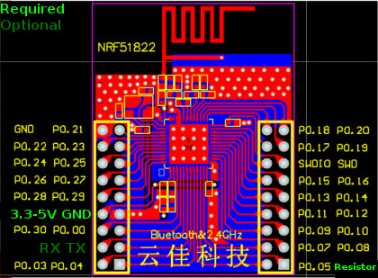

`motorica-org/telemetry-hardware-nrf51822-nrf5xbase <https://gitlab.com/motorica-org/telemetry-hardware-nrf51822-nrf5xbase>`_
=============================================================================================================================

Code for nrf51822 based on `nrf5x-base <https://github.com/lab11/nrf5x-base>`_.

Dependencies
------------

Ubuntu 16.04
++++++++++++

.. code:: sh

    sudo apt-get install build-essential git gcc-arm-none-eabi openocd

Usage
-----

.. code:: sh

    git clone $REPO --recursive # initialize submodules
    cd $REPO/apps/main/
    make
    make flash

Pinout
------

